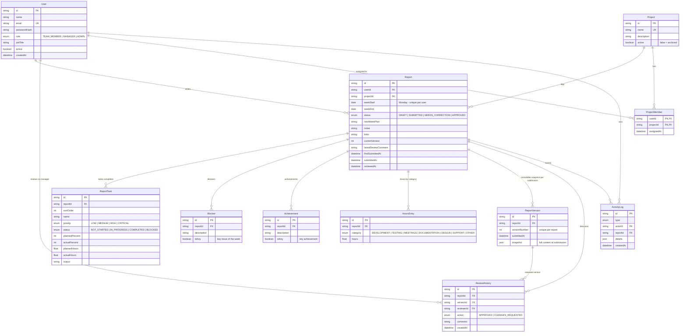

# Entity Relationship Diagram

Source of truth: `apps/api/prisma/schema.prisma`. Render this Mermaid diagram at https://mermaid.live (export as PNG/SVG for the submission folder).

## Design notes

- **One report per member per week** is enforced by the unique index on `(userId, weekStart)`; `weekStart` is always a Monday stored as a date-only column.
- **Fixed structure**: the sections are child tables with fixed columns (`ReportTask`, `Blocker`, `Achievement`, `HoursEntry`), not free-form JSON, so every report is comparable on the dashboard.
- **Version history**: submitting creates a `ReportVersion` row holding a JSON snapshot of the member-authored content. The live `Report` row is what the member edits; snapshots are never modified.
- **Review history**: each `ReviewHistory` row references the `ReportVersion` it was made against, which is how the UI shows "changes requested on version 1, approved on version 2". `Report.latestReviewComment` is a denormalised convenience copy.
- **Soft deletes**: users are deactivated, projects with reports are archived (`active = false`), so history is never lost. Deleting a `Report` cascades to its children.
- **Activity feed**: `ActivityLog` records submissions, review decisions and admin actions for the dashboard feed.
